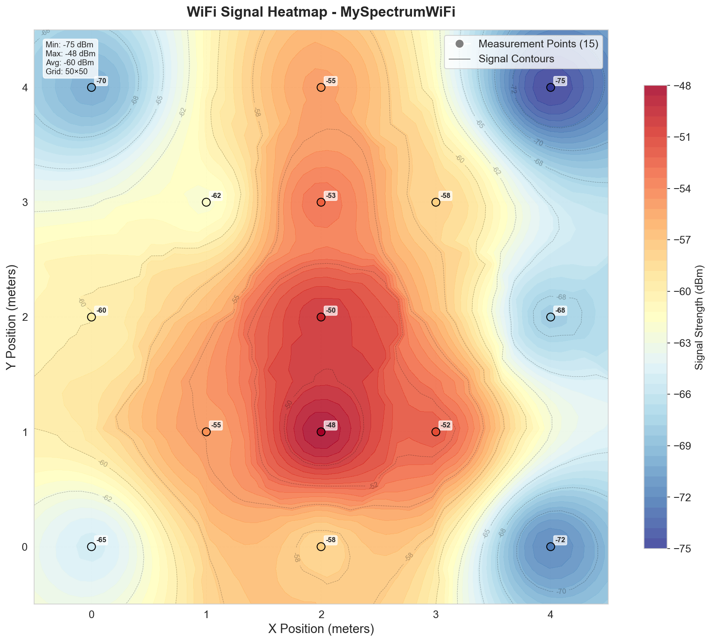
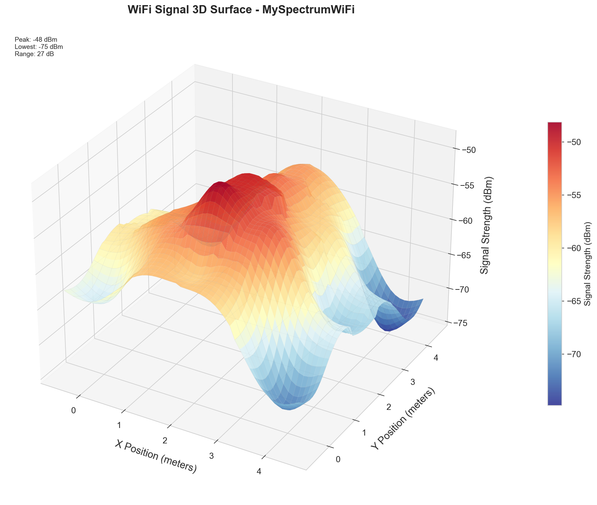
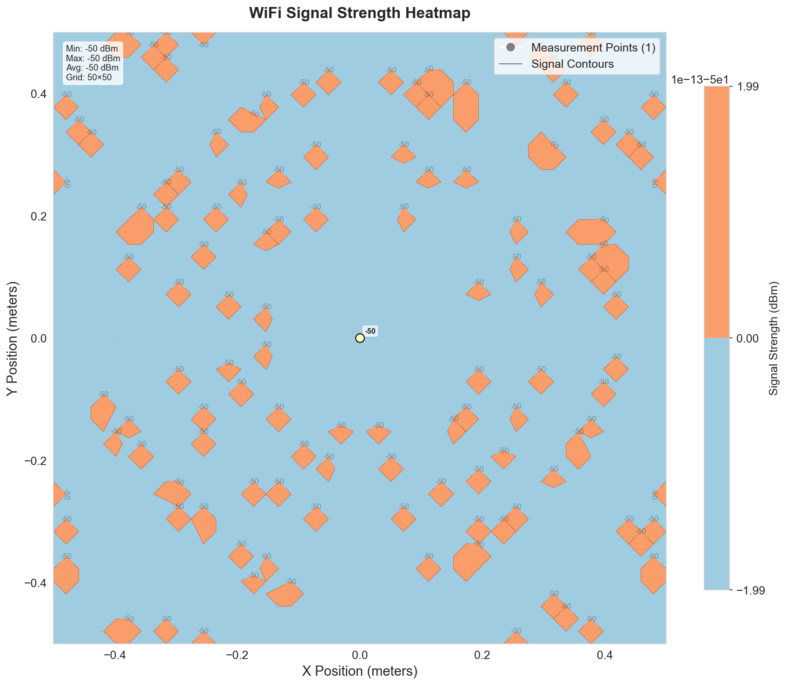
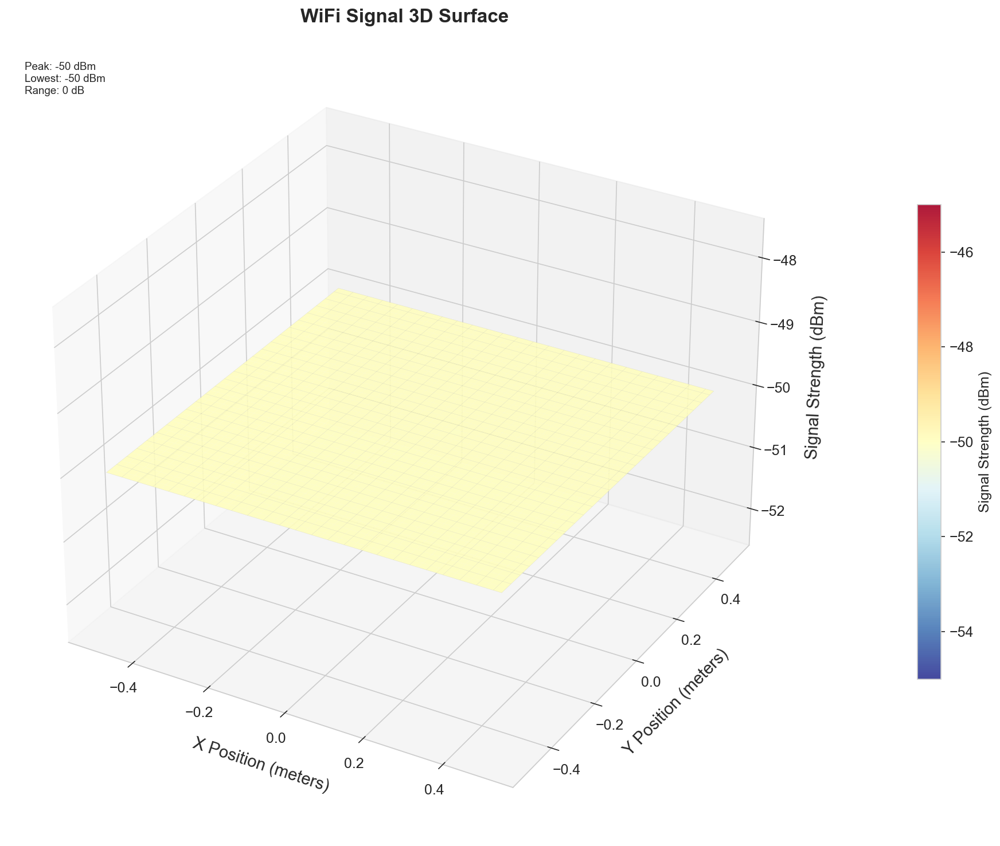
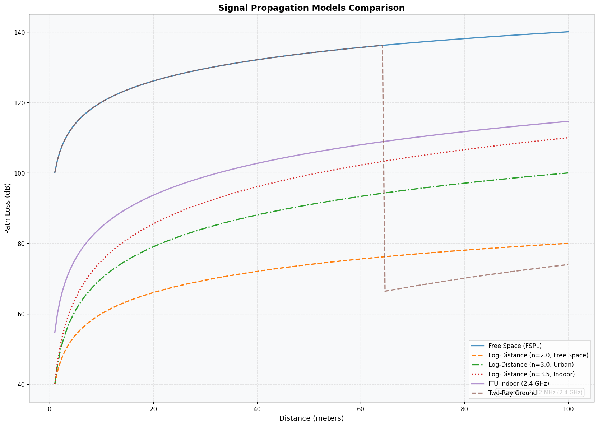
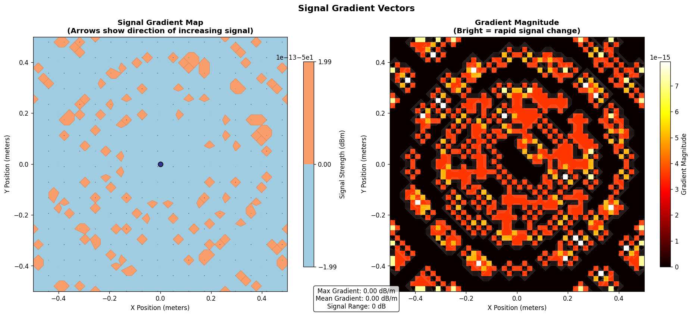
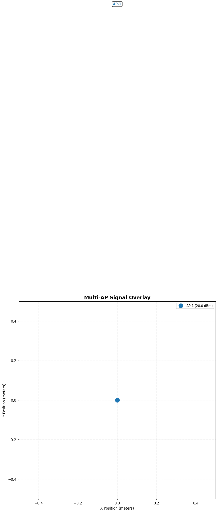
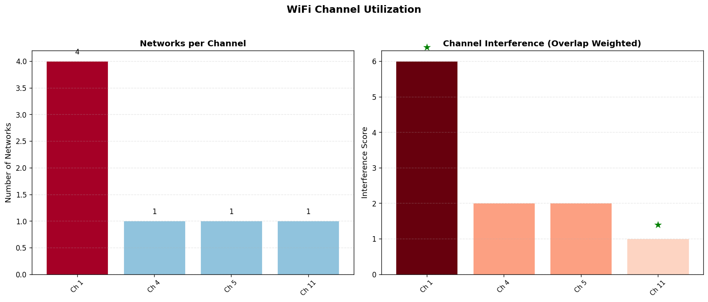
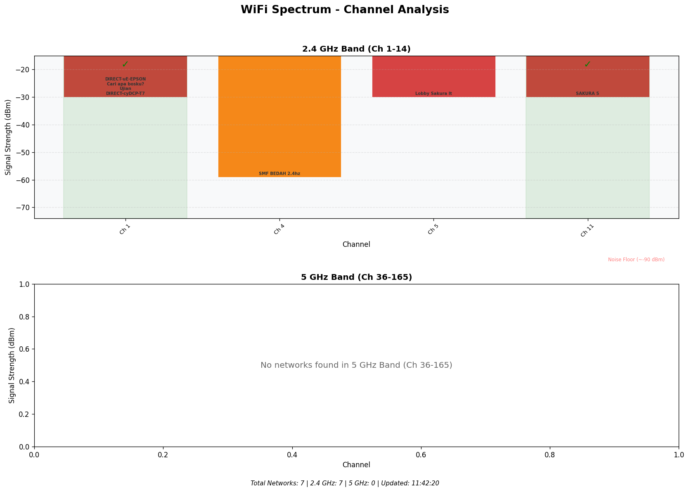
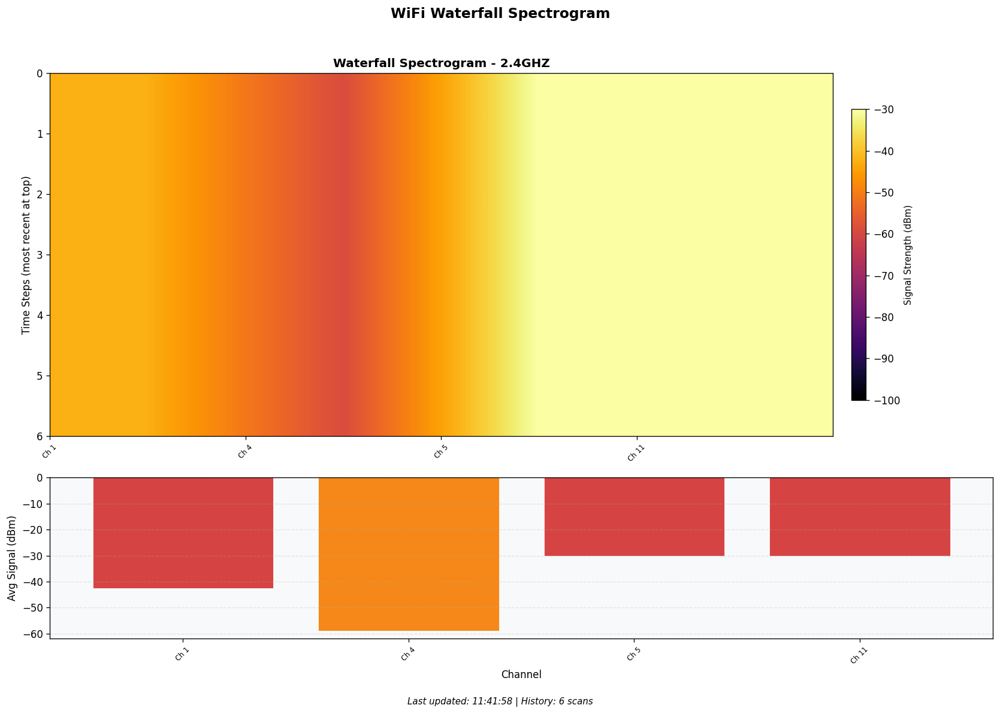

# SpectraLens


> **Mewujudkan Frekuensi WiFi Menjadi Bentuk Visual**  
> *"Making the invisible visible, one frequency at a time."*

---

## 👤 Creator & Owner

**Asmaul Asni Subegi, S.Kom**

- **Email**: sabayonx@gmail.com  
- **GitHub**: [xdr7](https://github.com/xdr7)  
- **Role**: Creator, Lead Developer, Concept Owner  
- **Project Start**: June 2026  
- **Repository**: [github.com/xdr7/SpectraLens](https://github.com/xdr7/SpectraLens)

---

## 🎯 Ringkasan Proyek

**SpectraLens** adalah aplikasi inovatif yang mengubah gelombang frekuensi WiFi (2.4 GHz / 5 GHz) menjadi representasi visual yang dapat dipahami. Dengan menangkap data kekuatan sinyal (RSSI) dari **WiFi adapter standar laptop/PC** dan menerapkan algoritma interpolasi spasial, SpectraLens menghasilkan:

| Output | Deskripsi |
|--------|-----------|
| 🖥️ **GUI Desktop (PyQt5)** | Aplikasi desktop dengan dark theme, 6 tab visualisasi interaktif |
| 📱 **Flutter App (Mobile)** | Aplikasi cross-platform Android/iOS (dalam pengembangan) |
| 🗺️ **Peta Panas 2D** | Distribusi kekuatan sinyal di suatu ruangan (merah = kuat, biru = lemah) |
| 🏔️ **Model Permukaan 3D** | "Medan frekuensi" yang menunjukkan area dengan sinyal terbaik dan terburuk |
| 📊 **Peta Spasial** | Analisis ruangan untuk penempatan router yang optimal |
| 📈 **Spectrum Analyzer** | Analisis spektrum frekuensi, penggunaan kanal, waterfall real-time |
| 📡 **Signal Propagation** | Model propagasi sinyal (path loss, coverage, gradient, multi-AP) |
| 🔴 **Realtime Monitor** | Monitoring kekuatan sinyal secara langsung |
| 🧪 **Unit Tests** | 6 test suite untuk validasi komponen inti |

---

## 💡 Akar Ide: Pertanyaan Mendasar

Proyek ini lahir dari sebuah pertanyaan sederhana namun mendalam:

> *"Apakah mungkin frekuensi dipetakan ke dalam bentuk gambar? Karena frekuensi itu gelombang, dan jangkauannya bisa diukur jaraknya, bisakah ia dibentuk menjadi wujud?"*

**Jawabannya:** **YA.** Frekuensi WiFi dapat diubah menjadi:
- Peta panas 2D
- Model permukaan 3D
- Peta spasial frekuensi
- Analisis spektrum & propagasi sinyal

Semua ini dapat dicapai hanya dengan **WiFi adapter standar** dan **Python** — tanpa perlu perangkat keras khusus.

---

## 🔬 Bagaimana Cara Kerjanya?

```
┌─────────────┐     ┌─────────────┐     ┌─────────────┐     ┌──────────────────┐
│ Pemindaian  │     │  Data RSSI  │     │ Interpolasi │     │   Visualisasi    │
│    WiFi     │ ──► │ + Posisi    │ ──► │    IDW      │ ──► │  GUI / CLI       │
│ (pywifiscan)│     │ (x,y)       │     │ + KNN       │     │  (PyQt5/Plotly/  │
└─────────────┘     └─────────────┘     └─────────────┘     │   Matplotlib)    │
                                                             └──────────────────┘
```

| Langkah | Deskripsi | Teknologi |
|---------|-----------|------------|
| 1 | Pindai jaringan WiFi, dapatkan nilai RSSI | `pywifiscan` / `netsh` / `iwlist` |
| 2 | Catat posisi (X,Y) dan kekuatan sinyal saat berjalan | Input manual / file CSV/JSON |
| 3 | Interpolasi titik yang tidak terukur menggunakan IDW + KNN | NumPy, SciPy (cKDTree) |
| 4 | Visualisasikan hasilnya melalui GUI atau CLI | PyQt5, Matplotlib, Plotly |

---

## 🖥️ GUI Application (PyQt5)

SpectraLens hadir dengan **antarmuka grafis (GUI)** berbasis PyQt5 dengan tema gelap modern:

### Tampilan GUI

| Tab | Deskripsi |
|-----|-----------|
| **Dashboard** | Overview sistem, quick actions, status koneksi |
| **Scanner** | Scan WiFi networks, tabel detail, bar chart signal strength |
| **Visualization** | Peta panas 2D + Model permukaan 3D interaktif |
| **Data Collection** | Input manual titik pengukuran (x, y, signal) |
| **Recording** | Sesi perekaman data pengukuran |
| **Realtime** | Monitoring kekuatan sinyal secara langsung |
| **Spectrum Analyzer** | Analisis spektrum frekuensi & waterfall |
| **Signal Propagation** | Model propagasi sinyal (4 visualisasi) |
| **About** | Informasi tentang aplikasi |

### Menjalankan GUI

```bash
python main.py gui
```

Atau langsung:

```bash
python -m gui.app
```

---

## 📱 Flutter App (Mobile - Dalam Pengembangan)

SpectraLens sedang dikembangkan sebagai **aplikasi mobile cross-platform** menggunakan Flutter:

### Struktur Flutter App

```
spectralens_app/
├── pubspec.yaml
└── lib/
    ├── main.dart                    # Entry point
    ├── models/
    │   └── measurement.dart         # Model data
    ├── providers/
    │   ├── app_state.dart           # State management global
    │   └── scan_provider.dart       # State management scan
    ├── screens/
    │   ├── dashboard_screen.dart    # Dashboard utama
    │   ├── scanner_screen.dart      # Scanner WiFi
    │   ├── heatmap_screen.dart      # Heatmap 2D
    │   ├── data_collection_screen.dart # Input data
    │   └── settings_screen.dart     # Pengaturan
    ├── widgets/
    │   ├── status_card.dart         # Kartu status
    │   └── signal_gauge.dart        # Gauge sinyal
    └── utils/
        └── constants.dart           # Konstanta & tema
```

### Screens yang Tersedia

| Screen | Deskripsi |
|--------|-----------|
| **Dashboard** | Ringkasan status, sinyal terkuat, jumlah AP terdeteksi |
| **Scanner** | Scan WiFi dengan animasi, daftar jaringan, detail sinyal |
| **Heatmap** | Visualisasi peta panas 2D (data dari Python backend) |
| **Data Collection** | Form input titik pengukuran manual |
| **Settings** | Konfigurasi aplikasi, tema, koneksi backend |

---

## 📊 Algoritma Inti: Inverse Distance Weighting (IDW)

Rumus interpolasi yang digunakan:

```python
# Rata-rata tertimbang berdasarkan jarak
weight = 1 / (distance ^ power)   # Semakin dekat, semakin besar bobotnya
value = Σ(weight_i × rssi_i) / Σ(weight_i)
```

Parameter yang dapat disesuaikan:
- **power** (default: 2) — Mengontrol seberapa cepat pengaruh sinyal berkurang dengan jarak
- **k** (default: 5) — Jumlah tetangga terdekat yang digunakan (KNN)
- **smoothing** (default: 1e-12) — Faktor smoothing untuk menghindari division by zero

---

## 🧪 Unit Tests

Terdapat **6 test suite** untuk memvalidasi komponen inti aplikasi:

| Test File | Deskripsi |
|-----------|-----------|
| `test_data_collector.py` | Validasi koleksi data pengukuran |
| `test_geometry.py` | Validasi perhitungan geometri & jarak |
| `test_database.py` | Validasi operasi database SQLite |
| `test_grid_builder.py` | Validasi pembuatan grid interpolasi |
| `test_idw.py` | Validasi algoritma IDW |
| `test_integration.py` | Validasi integrasi end-to-end |

```bash
# Jalankan semua test
python -m pytest tests/ -v

# Jalankan test spesifik
python -m pytest tests/test_idw.py -v
```

---

## 🛠️ Teknologi yang Digunakan

| Kategori | Teknologi |
|----------|-----------|
| Bahasa | Python 3.8+, Dart (Flutter) |
| GUI Framework (Desktop) | PyQt5 (Qt5) |
| Mobile Framework | Flutter (dalam pengembangan) |
| Pemindaian WiFi | pywifiscan, netsh (Windows), iwlist (Linux), airport (macOS) |
| Komputasi Numerik | numpy, scipy (cKDTree) |
| Visualisasi 2D | matplotlib, seaborn |
| Visualisasi 3D | plotly (interaktif), matplotlib (static) |
| Basis Data | sqlite3 (SQLite) |
| CLI Framework | argparse |
| Format Data | CSV, JSON |
| Testing | pytest |

---

## 📁 Struktur Proyek

```
spectralens/
│
├── main.py                    # Titik masuk utama (CLI + GUI)
├── requirements.txt           # Dependencies Python
├── checklist.md               # Progress checklist
├── .gitignore                 # Git ignore rules
│
├── gui/                       # Aplikasi GUI (PyQt5)
│   ├── __init__.py
│   ├── app.py                 # Entry point GUI
│   └── main_window.py         # Main window dengan tabs
│
├── scanner/                   # Akuisisi data WiFi
│   ├── __init__.py
│   ├── wifi_scanner.py        # Membaca RSSI dari adapter WiFi
│   └── data_collector.py      # Merekam posisi + kekuatan sinyal
│
├── interpolation/             # Interpolasi spasial
│   ├── __init__.py
│   ├── idw.py                 # Algoritma IDW dengan KNN optimization
│   └── grid_builder.py        # Membuat grid untuk visualisasi
│
├── visualization/             # Pembuatan output visual
│   ├── __init__.py
│   ├── heatmap_2d.py          # Peta panas 2D (contourf + scatter)
│   ├── surface_3d.py          # Plot permukaan 3D (static + interactive)
│   ├── spectrum_analyzer.py   # Analisis spektrum frekuensi
│   ├── signal_propagation.py  # Model propagasi sinyal
│   └── realtime.py            # Monitoring real-time
│
├── storage/                   # Penyimpanan data
│   ├── __init__.py
│   └── database.py            # Operasi SQLite (sessions, data_points)
│
├── utils/                     # Fungsi bantuan
│   ├── __init__.py
│   └── geometry.py            # Perhitungan jarak, bounding box, RSSI conversion
│
├── tests/                     # Unit tests
│   ├── __init__.py
│   ├── test_data_collector.py
│   ├── test_geometry.py
│   ├── test_database.py
│   ├── test_grid_builder.py
│   ├── test_idw.py
│   └── test_integration.py
│
├── spectralens_app/           # Flutter mobile app
│   ├── pubspec.yaml
│   └── lib/
│       ├── main.dart
│       ├── models/
│       ├── providers/
│       ├── screens/
│       ├── widgets/
│       └── utils/
│
├── data/                      # Data sample
│   └── sample_measurements.csv # Contoh data pengukuran untuk testing
│
└── output/                    # Hasil visualisasi
    ├── heatmap_15points.png
    ├── surface_3d_50x50.png
    ├── gui_heatmap.png
    ├── gui_surface_3d.png
    ├── gui_interactive.html
    ├── path_loss_comparison_2412mhz.png
    ├── gradient_vectors_50x50.png
    ├── multi_ap_overlay_1aps.png
    ├── channel_util_7nets.png
    ├── spectrum_bar_7nets.png
    └── waterfall_2.4ghz_6steps.png
```

---

## 🚀 Cara Memulai (Instalasi)

### Prasyarat

- Python 3.8 atau lebih baru
- WiFi adapter (bawaan laptop/PC sudah cukup)
- Hak akses Administrator/Root (untuk pemindaian WiFi di beberapa OS)

### Langkah-langkah

```bash
# 1. Clone repository
git clone https://github.com/xdr7/SpectraLens.git
cd SpectraLens

# 2. (Opsional) Buat virtual environment
python -m venv venv
source venv/bin/activate  # Di Windows: venv\Scripts\activate

# 3. Install dependencies
pip install -r requirements.txt

# 4. Jalankan aplikasi (GUI)
python main.py gui

# Atau via CLI
python main.py --help
```

---

## 📝 Panduan Penggunaan

### GUI Mode (Rekomendasi)

```bash
# Jalankan aplikasi GUI dengan dark theme
python main.py gui
```

### CLI Mode

```bash
# Melihat bantuan
python main.py --help

# Memindai jaringan WiFi
python main.py scan

# Visualisasi data dari file CSV
python main.py visualize data/sample_measurements.csv --type all

# Generate heatmap 2D
python main.py visualize data/sample_measurements.csv --type heatmap

# Generate 3D surface
python main.py visualize data/sample_measurements.csv --type surface

# Realtime monitoring
python main.py realtime
```

Output akan tersimpan di folder `output/`:
- `output/heatmap_15points.png` — Peta panas 2D
- `output/surface_3d_50x50.png` — Permukaan 3D static
- `output/gui_interactive.html` — Permukaan 3D interaktif (Plotly)

---

## 📊 Contoh Output Visualisasi

### Peta Panas 2D


Peta panas menunjukkan distribusi kekuatan sinyal WiFi di suatu area:
- **Merah** = Sinyal kuat (RSSI tinggi, mendekati -30 dBm)
- **Biru** = Sinyal lemah (RSSI rendah, mendekati -100 dBm)
- **Titik hitam** = Lokasi pengukuran dengan nilai RSSI
- **Garis kontur** = Batas area dengan kekuatan sinyal yang sama

### Permukaan 3D


Visualisasi 3D menunjukkan "medan frekuensi":
- **Puncak** = Area dengan sinyal terbaik
- **Lembah** = Area dengan sinyal terburuk

### GUI Heatmap


Tampilan heatmap dalam aplikasi GUI PyQt5.

### GUI Surface 3D


Tampilan permukaan 3D dalam aplikasi GUI PyQt5.

### Path Loss Comparison


Perbandingan model propagasi sinyal (FSPL, Log-Distance n=2.0/3.0/3.5).

### Gradient Vectors


Medan gradien sinyal yang menunjukkan arah perubahan kekuatan sinyal.

### Multi-AP Overlay


Visualisasi coverage dari beberapa Access Point secara bersamaan.

### Channel Utilization


Penggunaan kanal frekuensi oleh jaringan WiFi di sekitar.

### Spectrum Bar


Distribusi spektrum frekuensi dalam bentuk bar chart.

### Waterfall


Waterfall spectrum yang menunjukkan perubahan sinyal terhadap waktu.

---

## 🗺️ Peta Jalan (Roadmap)

| Fase | Status |
|------|--------|
| Konsep & Ideasi | ✅ Selesai |
| Desain Algoritma IDW | ✅ Selesai |
| Implementasi Python (dasar) | ✅ Selesai |
| Implementasi Python (lengkap) | ✅ Selesai |
| GUI Desktop (PyQt5) | ✅ Selesai |
| Spectrum Analyzer | ✅ Selesai |
| Signal Propagation Models | ✅ Selesai |
| Unit Tests (6 test suite) | ✅ Selesai |
| Flutter App (Mobile) - Struktur Dasar | ✅ Selesai |
| Flutter App (Mobile) - Services & Backend | ✅ Selesai |
| Testing & Dokumentasi | ✅ Selesai |
| Mode Rekam Jalan Langsung | ✅ Selesai |
| Pengajuan Paten / Hak Cipta | 📋 Direncanakan |

---

## 🤝 Kontribusi

Proyek ini saat ini sedang dalam pengembangan awal oleh pencipta. Untuk pertanyaan atau kolaborasi, silakan hubungi:

**Asmaul Asni Subegi, S.Kom** – sabayonx@gmail.com

---

## 📜 Lisensi

Hak Cipta (c) 2026 Asmaul Asni Subegi, S.Kom

Proyek ini dilisensikan di bawah Lisensi MIT - lihat file LICENSE untuk detail lengkap.

---

## 📧 Kontak

| Platform | Link / Info |
|----------|-------------|
| Email | sabayonx@gmail.com |
| GitHub | github.com/xdr7 |
